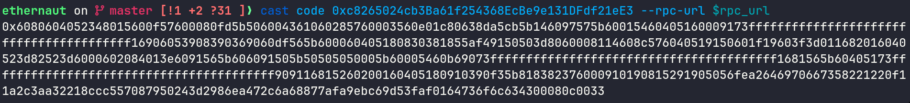
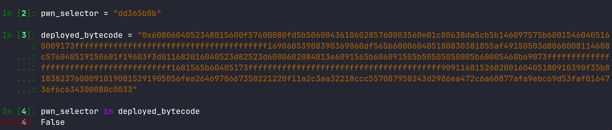
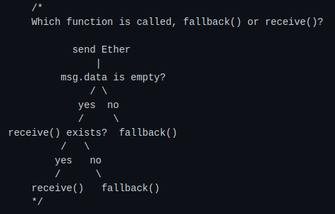
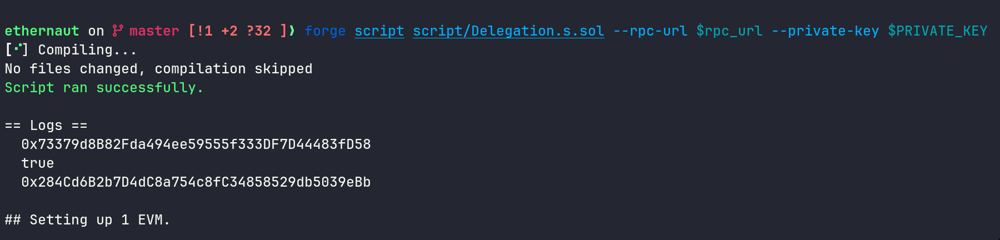

in this challenge we are given the code for 2 contracts and our goal is to claim ownership for the given contract instance

<!--more-->


- **Platform**: Ethernaut
- **Challenge**: Delegation
- **Category**: Blockchain
- **Description**: Claim ownership of the Delegation contract using delegatecall


```solidity
// SPDX-License-Identifier: MIT
pragma solidity ^0.8.0;

contract Delegate {
    address public owner;

    constructor(address _owner) {
        owner = _owner;
    }

    function pwn() public {
        owner = msg.sender;
    }
}

contract Delegation {
    address public owner;
    Delegate delegate;

    constructor(address _delegateAddress) {
        delegate = Delegate(_delegateAddress);
        owner = msg.sender;
    }

    fallback() external {
        (bool result,) = address(delegate).delegatecall(msg.data);
        if (result) {
            this;
        }
    }
}
```

the challenge description tell us to learn about the `delegatecall` low level function

we should understand when a contract make an external call to an another contract there are 3 types of calls that can happen : call, delegate call and static call

when a call is created it starts an  `execution context`

the execution context is simply the environment in the `evm` where the function runs, it determines the state variables we can access and many other things

when working with delegate calls the function runs in the context of the contract that is making the call , so if contract A calls contract B , contract B can access the state variables of contract A , this is useful in certain cases but can be dangerous too

getting back to our challenge lets first determine which contract instance we have

this is the `bytecode` for the contract address we have :



now we check if the function selector for the function `pwn()` is in it or not

1- if the selector is in the code then we are given the address for `Delegate`
2- otherwise we are given the address for `Delegation`

we check that using python :



since it returned False we can confirm that we have the address for the Delegation contract and we should claim ownership of this contract

In solidity state variables are laid in slots, each slot is 32 bytes

when contract A delegates to contract B, B code will run but treats A storage as its own

if B have 5 state variables defined, when the code is running, if it modifies the first state variable this will overrides A storage slot 0 , if we modify the 2nd state variable it overrides storage slot 1 , and so on

so if we trigger the fallback function of contract A

```solidity
fallback() external {
        (bool result,) = address(delegate).delegatecall(msg.data);
        if (result) {
            this;
        }
    }
```

this will delegates to contract B , if we set `msg.data` to the function selector of `pwn()`
this way the function pwn will get executed in context of contract A, so the value given to the state variable `owner` of contract B will be set to the storage slot 0 of contract A , and what state variable of A we have in the slot 0 ?

Yes `owner` !!! , so we claim ownership

now to make this exploit complete, lets recall when fallback is called



just add a note that in the case where `msg.data` is not empty
fallback get executed only if the given selector don't match any function signature that exists in the contract code

so if we pass `msg.data = selector of pwn()` since this matches no function in contract A, fallback will get executed, and it will delegate calls the function `pwn()` of contract B because of this line :

`(bool result,) = address(delegate).delegatecall(msg.data);`

and one important last note to add is that running the execution of this call , `msg.sender` will be our address , not the contract A address , because this is how delegate call works

now we create the solver script using forge script :

```solidity
// SPDX-License-Identifier: MIT
pragma solidity ^0.8.0;

import "../src/Delegation.sol";
import "forge-std/Script.sol";
import "forge-std/console.sol";


contract Solver is Script {
  Delegation instance = Delegation(0xc8265024cb3Ba61f254368EcBe9e131DFdf21eE3);

  function run() external {
     vm.startBroadcast(vm.envUint("PRIVATE_KEY"));
     console.log(instance.owner());
     (bool result , ) = address(instance).call(abi.encodeWithSignature("pwn()"));
     console.log(result);
     console.log(instance.owner());

  }
}
```

after running this locally :



we can see that we claimed ownership successfully so GG! the challenge is solved
