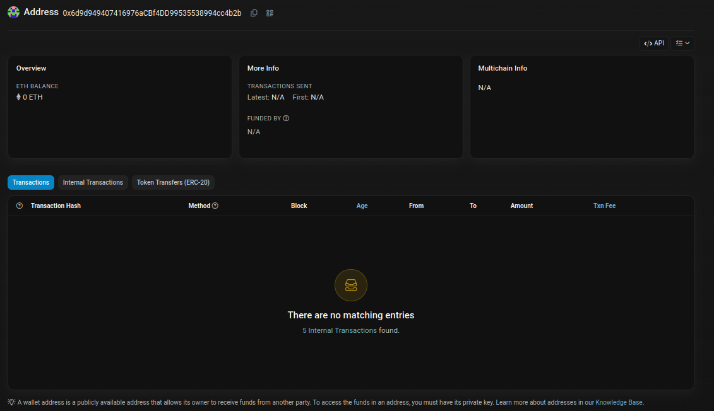
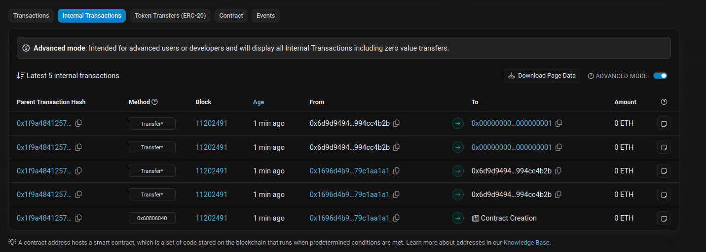
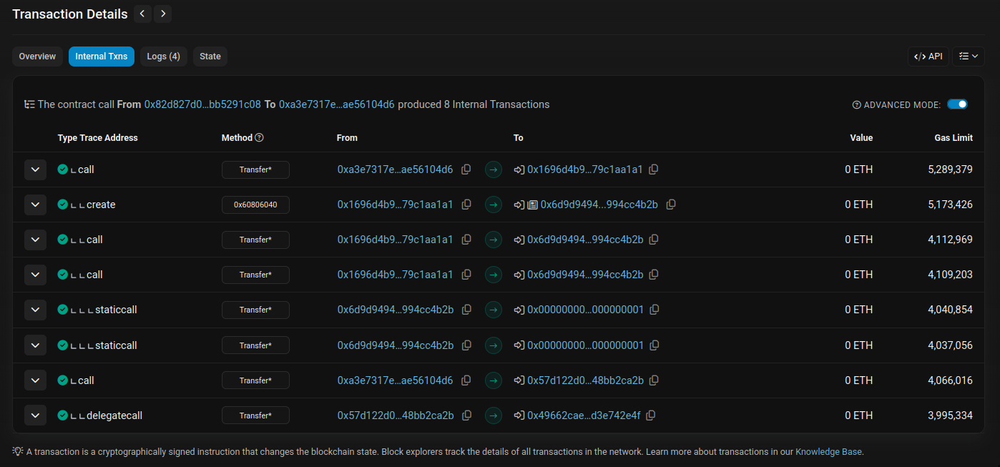
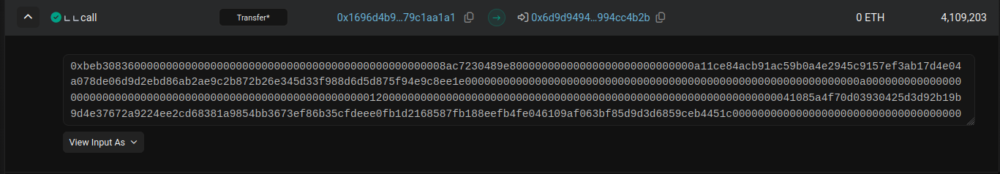
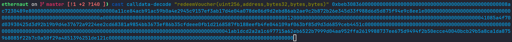
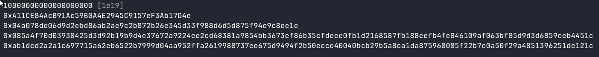
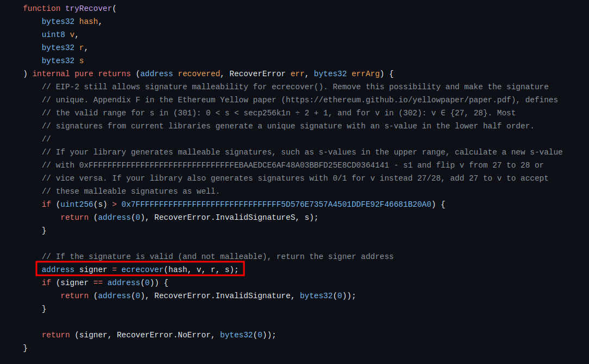
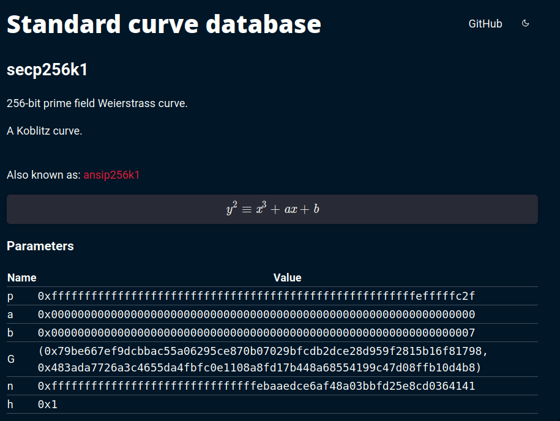
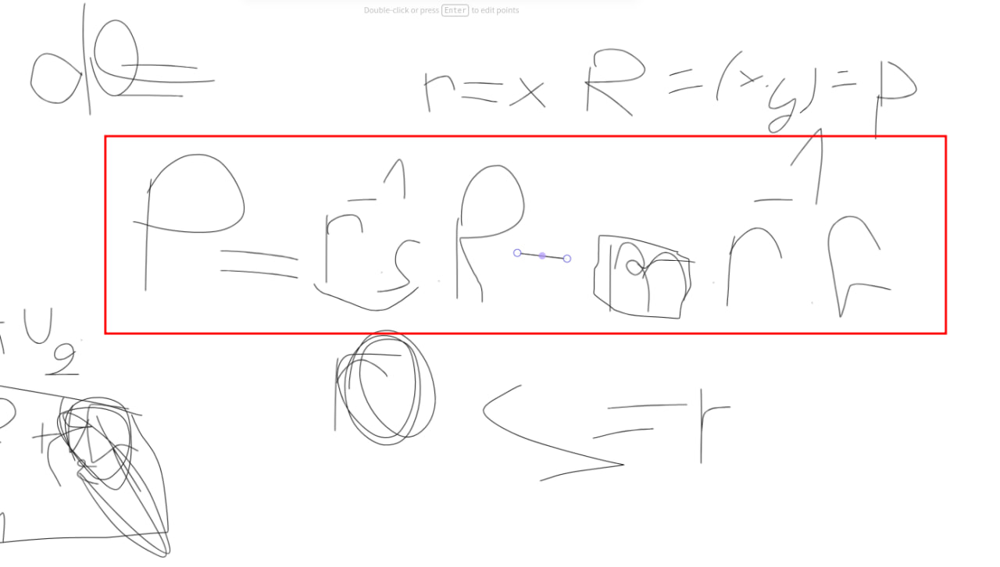

our goal is to steal the tokens that Alice just redeemed by using the fact that Bob skipped parts of the ECDSA algorithm

<!--more-->


- **Platform**: Ethernaut
- **Challenge**: EllipticToken
- **Category**: Blockchain


```solidity
// SPDX-License-Identifier: MIT
pragma solidity 0.8.28;

import {Ownable} from "openzeppelin-contracts-08/access/Ownable.sol";
import {ECDSA} from "openzeppelin-contracts-08/utils/cryptography/ECDSA.sol";
import {ERC20} from "openzeppelin-contracts-08/token/ERC20/ERC20.sol";

contract EllipticToken is Ownable, ERC20 {
    error HashAlreadyUsed();
    error InvalidOwner();
    error InvalidReceiver();
    error InvalidSpender();

    constructor() ERC20("EllipticToken", "ETK") {}

    mapping(bytes32 => bool) public usedHashes;

    function redeemVoucher(
        uint256 amount,
        address receiver,
        bytes32 salt,
        bytes memory ownerSignature,
        bytes memory receiverSignature
    ) external {
        bytes32 voucherHash = keccak256(abi.encodePacked(amount, receiver, salt));
        require(!usedHashes[voucherHash], HashAlreadyUsed());

        // Verify that the owner emitted the voucher
        require(ECDSA.recover(voucherHash, ownerSignature) == owner(), InvalidOwner());

        // Verify that the receiver accepted the voucher
        require(ECDSA.recover(voucherHash, receiverSignature) == receiver, InvalidReceiver());

        // Nullify the voucher
        usedHashes[voucherHash] = true;

        // Mint the tokens
        _mint(receiver, amount);
    }

    function permit(uint256 amount, address spender, bytes memory tokenOwnerSignature, bytes memory spenderSignature)
        external
    {
        bytes32 permitHash = keccak256(abi.encode(amount));
        require(!usedHashes[permitHash], HashAlreadyUsed());
        require(!usedHashes[bytes32(amount)], HashAlreadyUsed());

        // Recover the token owner that emitted the permit
        address tokenOwner = ECDSA.recover(bytes32(amount), tokenOwnerSignature);

        // Verify that the spender accepted the permit
        bytes32 permitAcceptHash = keccak256(abi.encodePacked(tokenOwner, spender, amount));
        require(ECDSA.recover(permitAcceptHash, spenderSignature) == spender, InvalidSpender());

        // Nullify the permit
        usedHashes[permitHash] = true;

        // Approve the spender
        _approve(tokenOwner, spender, amount);
    }
}
```

so the first thing the challenge description tells us is that Bob creates vouchers off-chain for a receiver (Alice in this case) and then Alice redeems the voucher, by looking at the challenge code we notice that the function `redeemVoucher` is the one used for the redeeming process

the challenge description tells us that our goal is to steal the tokens that Alice **just redeemed** by using the fact that Bob skipped parts of the `ECDSA algorithm`

to solve the challenge, lets start by looking in the contract for any logic that allows us to steal Alice's tokens. After analyzing the code we can notice that the only line that actually does that is `_approve(tokenOwner, spender, amount);` located at the end of the `permit` function, and this will only work if `tokenOwner` is Alice's address and `amount > 0`

so `tokenOwner` is computed in this line :

**`address tokenOwner = ECDSA.recover(bytes32(amount), tokenOwnerSignature);`**

this means in order to make it equal to Alice's address we should craft a pair amount,signature that gets verified into Alice's address

if you notice, recover is using the amount directly without hashing it, this is actually a vulnerability in *ecdsa* verification, the message should be hashed before verification, so we can say/assume that this is the missing step the challenge description talked about

for now we have 2 useful information :
1- we should make `tokenOwner` equal to Alice's address
2- the message isn't hashed, this should be the thing we will abuse

from now i will be talking about my attempts :

***1- use the same hash and signature used in the redemption***

we stated before that Alice just redeemed the voucher, so the function `redeemVoucher` should have been called and executed after we deployed that challenge, and since *Ethereum* is a public Blockchain, we can read the exact parameters values used in the call

ethernaut challenges are deployed in sepolia testnet, lets go and find the contract challenge there :



now by our previous assumption, there should be a transaction that called the redeem function, but where is it ??

well the explanation for this is that the initial transaction that started the challenge instance is the one that called the redeem function, so the call we are looking for will be found inside an internal transaction

so we check the internal transactions :



we go more deep and click on the parent transaction hash :



the call type for the function should be `call`, by checking the calls `calldata` the 4th is the one we are looking for



this is the bytecode

now to get the values of the parameters we execute this commend :



this will match each argument with the input value

the output will be :



this is actually a good advancement, we now have the value of :

* amount in the voucher
* the salt used for hashing
* Alice and Bob signatures


what we can do by these is : compute the same exact voucher hash that was used in the redeeming process, and since we know Alice's signature for this hash, we actually have a valid pair that verifies to Alice's public address

while i was doing this work, i thought it would work because in the permit function when they are not hashing, was an implementation typo, so they would only check if the hashed value of amount is used, but they are actually checking that in this line :

```
require(!usedHashes[bytes32(amount)], HashAlreadyUsed());
```

(yup i didn't read all the code carefully :/)

now my plan will not work!! because the idea was to cast the hash value we computed before into `uint256` and then use it as the amount, and they would check its hashed value only

well, hopefully there is a save for this!

lets take a look at `ECDSA.recover` to see how it works



without digging into all the code details, all we need to know is that this line is the one responsible for recovering the signer address (Alice's public address)

`ecrecover` is a built-in solidity function that implements the `ecdsa` verification algorithm, the curve used is `secp256k1` :



lets go one step deeper and look at how the recovery is done (this is my favorite part ^-^) :



so this some of my writing while i was solving the challenge (sorry for the ugly drawing haha)

as we can see this is how the public point of the verifier is computed (and then from it they compute the address)

notice that i wrote `m*r^-1`, generally it is `z*r^-1` where z is the hash message, but since they are not hashing in the challenge, i will use `m`

here we are doing `u1*R + u2*R` right?! (u1 and u2 are just shortcuts)

the scalars `u1` and `u2` are `mod n`, that is because we are working in the elliptic curves group

more precisely `u1*R` is actually an abbreviation for `R+R+R...` u1 times, and point addition is done modulo the order of the finite cyclic group of the elliptic curves

with this in mind, it is important to notice that this will open a way for collisions !!

because since we are not hashing, the amount we pass is directly used as `m` in the verification, and when working mod n, both m and m + n are the same number, but they are different hashes/numbers in the require check

***2- use the same hash + n and signature used in the redemption***

now since we proved that m and m+n will be equal inside `ECDSA.recover`, we can `uint256(hash) + n` instead of `uint256(hash)` (notice that by hash i mean the voucher hash for Alice they used in the redeem function) and it will pass the require check because it is actually a different value outside the verification

this should solve the challenge, right :) ?

well, i did hit a bad luck :// ,  hash + n overflowed (>256 bits)  and hash - n is negative

the whole work didn't work at the end


***3- i found another solution***

remember the previous verification equation, we will use that.

lets forget about trying to use the same signature of Alice, and forge a different signature that recovers Alice's public address (public point)

this is actually possible because they are not hashing :)

assume we take m = 0 (this wouldn't be possible in case they were hashing because a hash can't be zero)

the equation will become : `P = u1*R`, where `u1` is `r^-1 * s`

what would happen if we choose `r = Px` (the goal is  to make R = P) , and `s=r`, in this case `u1*R` will be equal to P, where P is the public point of Alice, This is the solution for the challenge for sure !!

well for m=0, we will steal zero tokens, but we can take m = n which is equivalent to 0

now there is something missing to fully craft this exploit, which is the x coordinate of P

we can't get it directly from Alice's address, that is just a part of the hash of P

**recovering the x coordinate of Alice's public point**

we stated before that we have a valid pair the verifies to Alice's public point, which is the signature and  voucher hash

*first we compute R*

we are still missing the y value for R, we compute it like this :

```
from sage.all import *
p = 0xfffffffffffffffffffffffffffffffffffffffffffffffffffffffefffffc2f
a = 0
b = 7
E = EllipticCurve(GF(p),[a,b])
r = 0xab1dcd2a2a1c697715a62eb6522b7999d04aa952ffa2619988737ee675d9494f
s = 0x2b50ecce40040bcb29b5a8ca1da875968085f22b7c0a50f29a4851396251de12
z = 0x87f1c8cd4c0e19511304b612a9b4996f8c2bd795796636bd25812cd5b0b6a973
n = 115792089237316195423570985008687907852837564279074904382605163141518161494337
r_inv = pow(r,-1,n)
G = E(0x79be667ef9dcbbac55a06295ce870b07029bfcdb2dce28d959f2815b16f81798, 0x483ada7726a3c4655da4fbfc0e1108a8fd17b448a68554199c47d08ffb10d4b8)
yy = pow(r,3,p) + 7
y = modular_sqrt(yy,p)
if y%2 == 1 :
    R = E(r,y)
```

Alice's signature is (r,s,v) where v tells us which y we take (modular_sqrt returns 2)

v was 28 which means y should be odd (we take the even value if v=27)

after recovering R we compute P by : (python code)

```
P = r_inv * s * R - z * r_inv * G
```

and this is the solidity code i used to extract r,s,v from Alice's signature:

```
 bytes memory signature = hex"ab1dcd2a2a1c697715a62eb6522b7999d04aa952ffa2619988737ee675d9494f2b50ecce40040bcb29b5a8ca1da875968085f22b7c0a50f29a4851396251de121c";

    bytes32 r;
    bytes32 s;
    uint8 v;

assembly ("memory-safe") {
    r := mload(add(signature, 0x20))
    s := mload(add(signature, 0x40))
    v := byte(0, mload(add(signature, 0x60)))
}
    console.logBytes32(r);
    console.logBytes32(s);
    console.log(v);
```

this is the x value we recovered :
`23454111434303081435929071042469611746672141632665808216069109536628528697239`

now we craft our signature by setting r = s = x and v = 27

there is an extra security alert that forbids values of s > n/2, in our case s was smaller, but if it weren't, can simply replace s by n - s and set v = 28

```
     bytes memory tokenOwnerSignature= hex'33da8e7fe906411e4fc12842632ec77c2aee6a4324a4a3ca554b56667e4ccf9733da8e7fe906411e4fc12842632ec77c2aee6a4324a4a3ca554b56667e4ccf971b';
     
     uint256 amount = 115792089237316195423570985008687907852837564279074904382605163141518161494337;
     
     bytes32 permitAcceptHash = keccak256(abi.encodePacked(0xA11CE84AcB91Ac59B0A4E2945C9157eF3Ab17D4e,0x284Cd6B2b7D4dC8a754c8fC34858529db5039eBb, amount));
```

these are the values we will be passing to the permit function, last thing is we compute the signature for `permitAcceptHash` using our private key, this is straight forward

we can check that they recover to Alice's public point by running :

`address tokenOwner = ECDSA.recover(bytes32(amount), tokenOwnerSignature);`

and print the address

after checking that we are correct, we execute :
`instance.permit(amount,0x284Cd6B2b7D4dC8a754c8fC34858529db5039eBb,tokenOwnerSignature,spenderSignature);`

where `0x28...` is the address i will transferring tokens to

and we solve the challenge by stealing the tokens using :

`_approve(tokenOwner, spender, amount);`

this is the full solidity code :

```solidity
// SPDX-License-Identifier: MIT
pragma solidity ^0.8.0;

import "../src/EllipticToken.sol";
import {Script} from "forge-std/Script.sol";
import "../forge-std/console.sol";


contract Solver is Script {
  EllipticToken instance = EllipticToken(0x54056d5f90Fa1352602167405A91c6071BaB9096);

  function run() external {
     vm.startBroadcast(vm.envUint("PRIVATE_KEY"));
     address Alice = 0xA11CE84AcB91Ac59B0A4E2945C9157eF3Ab17D4e;
     bytes32 salt = 0x04a078de06d9d2ebd86ab2ae9c2b872b26e345d33f988d6d5d875f94e9c8ee1e;
    bytes memory signature = hex"ab1dcd2a2a1c697715a62eb6522b7999d04aa952ffa2619988737ee675d9494f2b50ecce40040bcb29b5a8ca1da875968085f22b7c0a50f29a4851396251de121c";

    bytes32 r;
    bytes32 s;
    uint8 v;

assembly ("memory-safe") {
    r := mload(add(signature, 0x20))
    s := mload(add(signature, 0x40))
    v := byte(0, mload(add(signature, 0x60)))
}
    console.logBytes32(r);
    console.logBytes32(s);
    console.log(v);
    bytes32 voucherHash = keccak256(abi.encodePacked(uint256(10000000000000000000), Alice, salt));
    uint256 voucherHashInt = uint256(voucherHash) ;
    console.logBytes32(voucherHash);


     bytes memory tokenOwnerSignature= hex'33da8e7fe906411e4fc12842632ec77c2aee6a4324a4a3ca554b56667e4ccf9733da8e7fe906411e4fc12842632ec77c2aee6a4324a4a3ca554b56667e4ccf971b';
     uint256 amount = 115792089237316195423570985008687907852837564279074904382605163141518161494337;
     bytes32 permitAcceptHash = keccak256(abi.encodePacked(0xA11CE84AcB91Ac59B0A4E2945C9157eF3Ab17D4e,0x284Cd6B2b7D4dC8a754c8fC34858529db5039eBb, amount));
     
     console.logBytes32(permitAcceptHash);

     bytes memory spenderSignature = hex"48cbfa3546c0aa10fae491e66c3c76e2aeb3db53943e77e0ceedcf449d90ec96455a1f4143982b6aebd28805ca9055b277978ebabe0cd17b02754557d80260721b";

     address tokenOwner = ECDSA.recover(bytes32(amount), tokenOwnerSignature);
     console.log(tokenOwner);

     instance.permit(amount,0x284Cd6B2b7D4dC8a754c8fC34858529db5039eBb,tokenOwnerSignature,spenderSignature);
     instance.transferFrom(Alice,0x284Cd6B2b7D4dC8a754c8fC34858529db5039eBb,uint256(10000000000000000000));

  }
}
```

**resources :

for elliptic curves, i would recommend :

https://rareskills.io/zk-book module 1, chapter 4 to 9, it has one of the best explanations i found about groups and elliptic curves, looking at elliptic curves as a group and finite field is actually really helpful

https://github.com/elikaski/ECC_Attacks this repo is also good, i like the explanation

https://cryptohack.org/challenges/ecc/ this challenges can help you understand and apply more

https://hackropole.fr/fr/crypto/ you can find more difficult challenges here

THANK YOU !!! IF YOU READ THIS I REALLY REALLY APPRECIATE YOUR TIME
