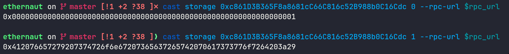
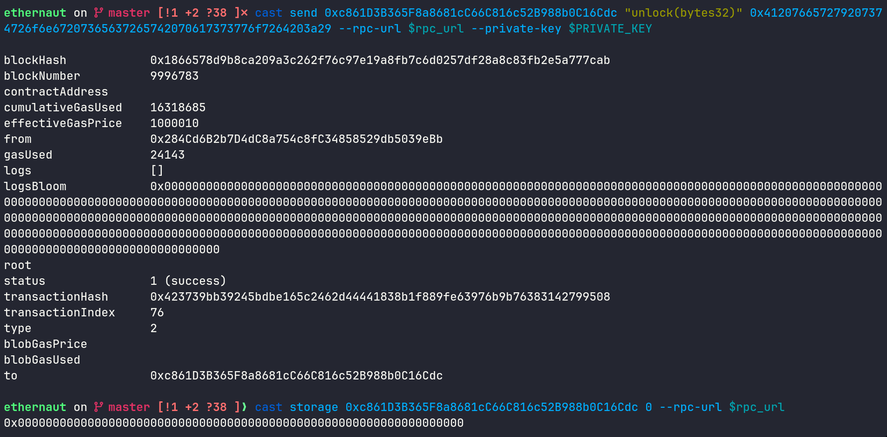

we are given this contract instance and our task is to set `locked` to `false`

<!--more-->


- **Platform**: Ethernaut
- **Challenge**: Vault
- **Category**: Blockchain


```solidity
// SPDX-License-Identifier: MIT
pragma solidity ^0.8.0;

contract Vault {
    bool public locked;
    bytes32 private password;

    constructor(bytes32 _password) {
        locked = true;
        password = _password;
    }

    function unlock(bytes32 _password) public {
        if (password == _password) {
            locked = false;
        }
    }
}
```

we observe the public function `unlock` which opens the vault if we give it the correct password, if the password was public we could read the value simply through the abi, but since it is private that is not possible

ethereum is a public blockchain, this means that every node can store a copy of the full ledger and we can query any data recorded by it including smart contract storage

this means by knowing the address of the contract we can read the value of any state variable even if it is marked as private, what is left now is locating which slot it is stored in — the evm stores variables sequentially and order matters, so `locked` is in slot 0 (1 byte), and since 31 bytes remain the 32-byte `password` goes into slot 1

we can confirm that using `cast storage`:



now we send this value to the contract to solve the challenge:



slot 0 became equal to 0 meaning the value of `locked` is `false`

mission done!
